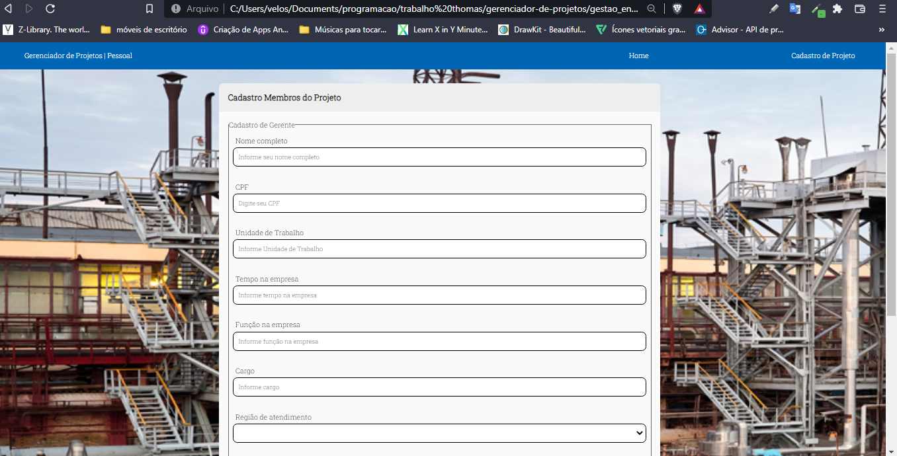

# Gerenciador de Projeto

Projeto front-end *Gerenciador de projetos*

### Descrição do projeto
> Projeto front-end simples que consiste em três telas, home, gestão de engenheiro e cadastro de projeto, que utilizando HTML, CSS e JS.

### Screenshots do projeto

    

    

    

